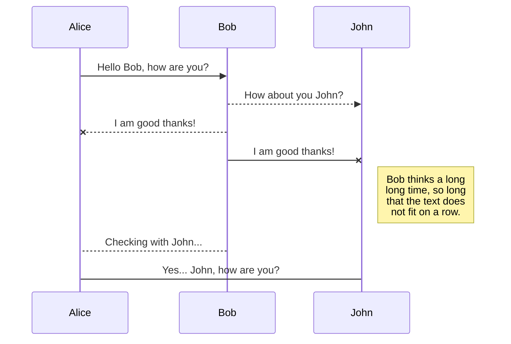

#欢迎来到 StackEdit！

你好！我是你在** StackEdit **中的第一个 Markdown 文件。如果你想了解 StackEdit，你可以阅读我。如果你想玩 Markdown，你可以编辑我。一旦你完成了我的编辑，你就可以通过打开导航栏左角的**文件资源管理器**来创建新文件。


#文件

StackEdit 将您的文件存储在您的浏览器中，这意味着您的所有文件都会自动保存在本地并可离线访问！**

##创建文件和文件夹

可以使用导航栏左上角的按钮访问文件资源管理器。您可以通过单击文件资源管理器中的**新建文件**按钮来创建新文件。您还可以通过单击**新建文件夹**按钮来创建文件夹。

##开始另一个文件

所有文件和文件夹都以树状结构显示在文件资源管理器中。单击树状结构中的文件即可在各个文件和文件夹之间切换。

##文件

您可以通过单击导航的文件名或单击文件资源管理器中的**重命名**按钮来重命名当前文件。

##删除文件

您可以通过点击文件资源管理器中的**删除**按钮来删除当前文件。该文件将被移至**垃圾**文件夹，并在7天不活动后自动删除。

##导出文件

您可以通过点击菜单中的**导出到磁盘**来导出当前文件。您可以选择将文件导出为纯Markdown、使用Handlebars模板的HTML或PDF。


#动态

同步是 StackEdit 最大的功能之一。它使您可以将工作区中的任何文件与存储在** Google Drive **、** Dropbox **和** GitHub **账户中的其他文件同步。继续在其他设备上编写的，与您共享文件的人协作，轻松集成到您的工作流程中……每分钟的同步机制都在后台进行，下载、合并和上传文件。

同步有两种类型，可以补充：

- The workspace synchronization will sync all your files, folders and settings automatically. This will allow you to fetch your workspace on any other device.
	> To start syncing your workspace, just sign in with Google in the menu.

- The file synchronization will keep one file of the workspace synced with one or multiple files in **Google Drive**, **Dropbox** or **GitHub**.
	> Before starting to sync files, you must link an account in the **Synchronize** sub-menu.

## Open a file

You can open a file from **Google Drive**, **Dropbox** or **GitHub** by opening the **Synchronize** sub-menu and clicking **Open from**. Once opened in the workspace, any modification in the file will be automatically synced.

## Save a file

You can save any file of the workspace to **Google Drive**, **Dropbox** or **GitHub** by opening the **Synchronize** sub-menu and clicking **Save on**. Even if a file in the workspace is already synced, you can save it to another location. StackEdit can sync one file with multiple locations and accounts.

## Synchronize a file

Once your file is linked to a synchronized location, StackEdit will periodically synchronize it by downloading/uploading any modification. A merge will be performed if necessary and conflicts will be resolved.

If you just have modified your file and you want to force syncing, click the **Synchronize now** button in the navigation bar.

> **Note:** The **Synchronize now** button is disabled if you have no file to synchronize.

## Manage file synchronization

Since one file can be synced with multiple locations, you can list and manage synchronized locations by clicking **File synchronization** in the **Synchronize** sub-menu. This allows you to list and remove synchronized locations that are linked to your file.


# Publication

Publishing in StackEdit makes it simple for you to publish online your files. Once you're happy with a file, you can publish it to different hosting platforms like **Blogger**, **Dropbox**, **Gist**, **GitHub**, **Google Drive**, **WordPress** and **Zendesk**. With [Handlebars templates](http://handlebarsjs.com/), you have full control over what you export.

> Before starting to publish, you must link an account in the **Publish** sub-menu.

## Publish a File

You can publish your file by opening the **Publish** sub-menu and by clicking **Publish to**. For some locations, you can choose between the following formats:

- Markdown: publish the Markdown text on a website that can interpret it (**GitHub** for instance),
- HTML: publish the file converted to HTML via a Handlebars template (on a blog for example).

## Update a publication

After publishing, StackEdit keeps your file linked to that publication which makes it easy for you to re-publish it. Once you have modified your file and you want to update your publication, click on the **Publish now** button in the navigation bar.

> **Note:** The **Publish now** button is disabled if your file has not been published yet.

## Manage file publication

Since one file can be published to multiple locations, you can list and manage publish locations by clicking **File publication** in the **Publish** sub-menu. This allows you to list and remove publication locations that are linked to your file.


# Markdown extensions

StackEdit extends the standard Markdown syntax by adding extra **Markdown extensions**, providing you with some nice features.

> **ProTip:** You can disable any **Markdown extension** in the **File properties** dialog.


## SmartyPants

SmartyPants converts ASCII punctuation characters into "smart" typographic punctuation HTML entities. For example:

|                |ASCII                          |HTML                         |
|----------------|-------------------------------|-----------------------------|
|Single backticks|`'Isn't this fun?'`            |'Isn't this fun?'            |
|Quotes          |`"Isn't this fun?"`            |"Isn't this fun?"            |
|Dashes          |`-- is en-dash, --- is em-dash`|-- is en-dash, --- is em-dash|


## KaTeX

You can render LaTeX mathematical expressions using [KaTeX](https://khan.github.io/KaTeX/):

The *Gamma function* satisfying $\Gamma(n) = (n-1)!\quad\forall n\in\mathbb N$ is via the Euler integral

$$
\Gamma(z) = \int_0^\infty t^{z-1}e^{-t}dt\,.
$$

> You can find more information about **LaTeX** mathematical expressions [here](http://meta.math.stackexchange.com/questions/5020/mathjax-basic-tutorial-and-quick-reference).


## UML diagrams

You can render UML diagrams using [Mermaid](https://mermaidjs.github.io/). For example, this will produce a sequence diagram:



And this will produce a flow chart:

```美人
鱼图 LR 
A[方形矩形] -- 链接文本 --> B((圆形矩形)) 
A --> C(圆形矩形) 
B --> D{菱形} 
C --> D ```

<!--stackedit_data:
eyJoaXN0b3J5IjpbODAwOTI5MTEyXX0=
-->