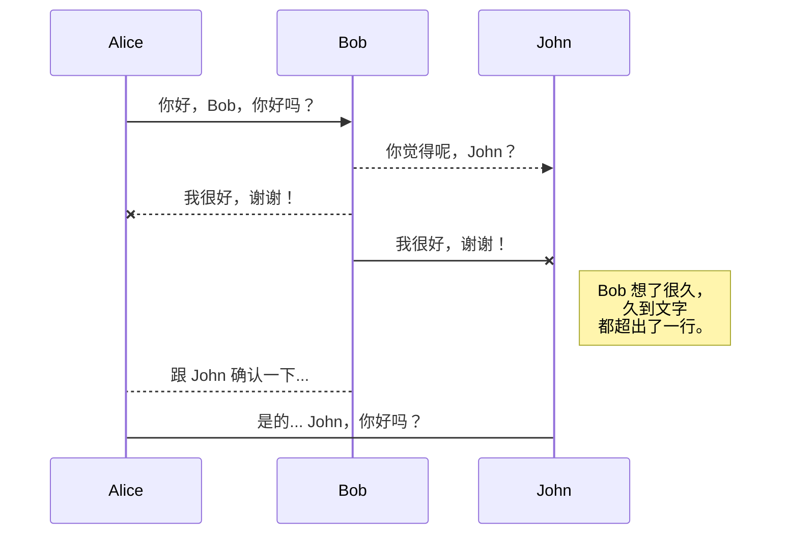
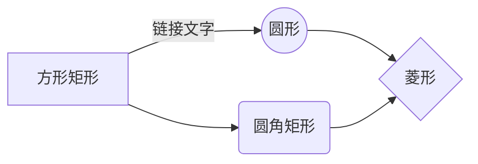

# 欢迎使用 StackEdit！

你好！我是你在 **StackEdit** 中的第一个 Markdown 文件。如果你想了解 StackEdit 的功能，可以阅读我。如果你想体验 Markdown 的语法，可以编辑我。一旦完成，你可以通过导航栏左上角的 **文件浏览器** 创建新文件。

----------

# 文件

StackEdit 会将你的文件存储在浏览器中，这意味着所有文件会自动保存在本地，并且可以离线访问！

## 创建文件和文件夹

文件浏览器可以通过导航栏左上角的按钮访问。你可以点击文件浏览器中的 **新建文件** 按钮创建新文件，也可以通过 **新建文件夹** 按钮创建文件夹。

## 切换文件

所有的文件和文件夹会以树状结构显示在文件浏览器中。你可以通过点击树中的文件切换到其他文件。

## 重命名文件

你可以通过点击导航栏中的文件名或在文件浏览器中点击 **重命名** 按钮来重命名当前文件。

## 删除文件

你可以通过点击文件浏览器中的 **移除** 按钮删除当前文件。文件会被移到 **垃圾箱** 文件夹，7 天未使用后会自动删除。

## 导出文件

你可以通过菜单中的 **导出到磁盘** 按钮导出当前文件。你可以选择将文件导出为纯 Markdown、使用 Handlebars 模板生成的 HTML 或 PDF 文件。

----------

# 同步功能

同步是 StackEdit 的一大特色。它允许你将工作区中的文件与存储在 **Google Drive**、**Dropbox** 和 **GitHub** 账户中的文件同步。这样你可以在不同设备上继续写作，与共享文件的人协作，并轻松融入你的工作流程。同步机制每分钟都会在后台运行，下载、合并并上传文件修改。

同步有两种方式，可以相辅相成：

-   **工作区同步** 会自动同步所有文件、文件夹和设置。这允许你在其他设备上恢复工作区。
    
    > 开始同步工作区，只需通过菜单使用 Google 登录。
    
-   **文件同步** 会将工作区中的一个文件与 **Google Drive**、**Dropbox** 或 **GitHub** 中的一个或多个文件保持同步。
    
    > 开始同步文件之前，需在 **同步** 子菜单中链接账户。
    

## 打开文件

你可以通过 **同步** 子菜单中的 **从...打开** 按钮，从 **Google Drive**、**Dropbox** 或 **GitHub** 中打开文件。一旦文件被打开，工作区中的任何修改都会自动同步。

## 保存文件

你可以通过 **同步** 子菜单中的 **保存到...** 按钮，将任何工作区中的文件保存到 **Google Drive**、**Dropbox** 或 **GitHub**。即使文件已经同步到某个位置，你也可以将它保存到另一个位置。StackEdit 支持一个文件同步到多个位置和账户。

## 同步文件

一旦文件链接到同步位置，StackEdit 会定期同步，下载/上传任何修改。如果需要，还会进行合并并解决冲突。

如果你刚修改了文件，想强制同步，可以点击导航栏中的 **立即同步** 按钮。

> **注意：** 如果没有文件需要同步，**立即同步** 按钮将被禁用。

## 管理文件同步

由于一个文件可以同步到多个位置，你可以通过 **同步** 子菜单中的 **文件同步** 按钮列出和管理同步位置。这允许你列出并移除与文件链接的同步位置。

----------

# 发布

StackEdit 的发布功能让你可以轻松在线发布文件。一旦文件准备好，可以将其发布到 **Blogger**、**Dropbox**、**Gist**、**GitHub**、**Google Drive**、**WordPress** 和 **Zendesk** 等平台。借助 [Handlebars 模板](http://handlebarsjs.com/)，你可以完全控制导出的内容。

> 开始发布之前，需在 **发布** 子菜单中链接账户。

## 发布文件

你可以通过 **发布** 子菜单中的 **发布到...** 按钮发布文件。对于某些平台，可以选择以下格式：

-   **Markdown**：将 Markdown 文本发布到支持解析它的网站（例如 **GitHub**）。
-   **HTML**：通过 Handlebars 模板将文件转换为 HTML 并发布到博客等平台。

## 更新发布

发布后，StackEdit 会将文件与发布内容链接，方便你重新发布。一旦修改了文件，可以点击导航栏中的 **立即发布** 按钮更新发布。

> **注意：** 如果文件尚未发布，**立即发布** 按钮将被禁用。

## 管理文件发布

由于一个文件可以发布到多个位置，你可以通过 **发布** 子菜单中的 **文件发布** 按钮列出和管理发布位置。这允许你列出并移除与文件链接的发布位置。

----------

# Markdown 扩展

StackEdit 扩展了标准的 Markdown 语法，增加了许多额外功能。

> **提示：** 你可以在 **文件属性** 对话框中禁用任何 **Markdown 扩展**。

## SmartyPants

SmartyPants 将 ASCII 标点字符转换为“智能”排版 HTML 实体。例如：

ASCII

HTML

单引号

`'这不是很有趣吗？'`

‘这不是很有趣吗？’

双引号

`"这不是很有趣吗？"`

“这不是很有趣吗？”

破折号

`-- 是短破折号，--- 是长破折号`

– 是短破折号，— 是长破折号

## KaTeX

你可以使用 [KaTeX](https://khan.github.io/KaTeX/) 渲染 LaTeX 数学表达式：

满足 $\Gamma(n) = (n-1)!\quad\forall n\in\mathbb N$ 的 **伽玛函数** 可通过欧拉积分定义为：

Γ(z)=∫0∞tz−1e−tdt .\Gamma(z) = \int_0^\infty t^{z-1}e^{-t}dt\,.Γ(z)=∫0∞​tz−1e−tdt.

> 更多关于 **LaTeX** 数学表达式的信息，请参考 [此处](http://meta.math.stackexchange.com/questions/5020/mathjax-basic-tutorial-and-quick-reference)。

## UML 图表

你可以使用 [Mermaid](https://mermaidjs.github.io/) 渲染 UML 图表。例如，这将生成一个时序图：

复制代码

这将生成一个流程图：

mermaid

<!--stackedit_data:
eyJoaXN0b3J5IjpbMTk4NTU2NzY4NSw3NTI5Njg2OV19
-->