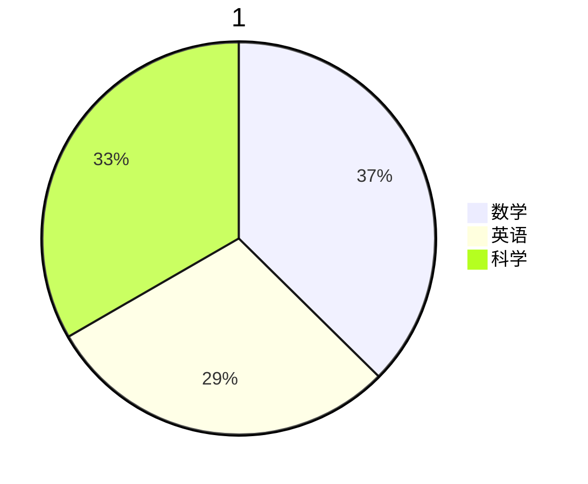

## 基础教程
### 1. 标题
```
一级标题：# ……
二级标题：## ……
三级标题：### ……
四级标题：#### ……
五级标题：##### ……
六级标题：###### ……
```

### 2. 粗体
```
__ 或者 ** 包围
```

### 3. 斜体
```
* 或者 _ 包围
```

### 4. 删除线
```
～～包围
```

### 5. 代码和代码块
```
代码：`包围
代码块：```包围，在```后面可以写语言
```

### 6. 引用
```
> 你好
> > 你好
```

### 7. 列表
```
无序列表：- 或者 + 开头
有序列表：数字 + . 开头
```

### 8. 上/下标
```
上标：^ 包围
下标：~ 包围
```
### 9. 链接
```
[文本](链接)
```
[你好](#)

### 10. 任务列表
```
Todo:
- [ ] 你好
- [ ] 我很好
```

- [x] 你好
- [ ] 我很好

### 11. 表格
```
| 学号 | 姓名 | 年龄 |
| :--- | :---: | --: |
| 523003 | Bret | 11 |
```

### 12. 图片
```

```


### 13. 分割线
```
三个*或者-或者_
```


## 🔥进阶教程
### 1. 使用HTML
<p style="color:red;">我是HTML</p>
style 不能在这里使用！

### 2.

### 3. Mermaid


<!--stackedit_data:
eyJoaXN0b3J5IjpbLTE2NjE1NzIzMjAsMTg0ODU2NzEzOSwtNz
A2OTY4OTI5LC03ODEzNjc3OTksLTE0MzQwNzIxMjksLTIwMzcx
MjU2NzldfQ==
-->